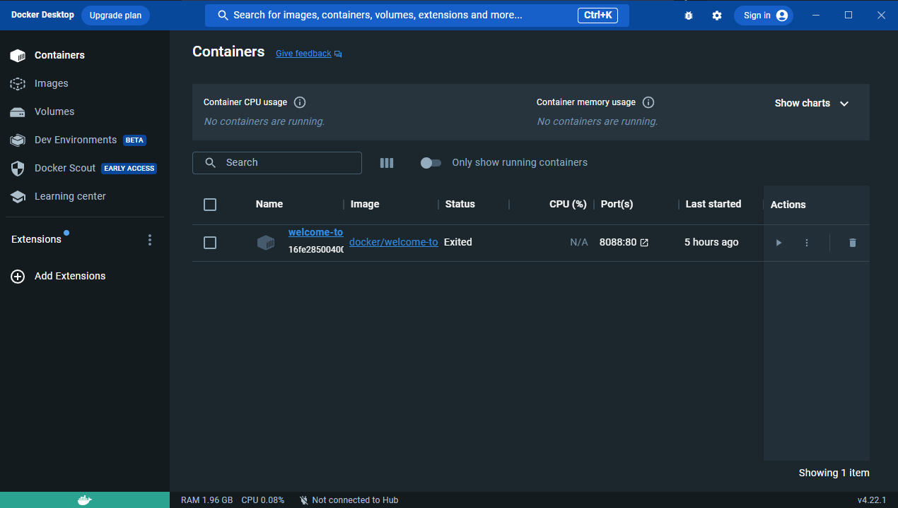
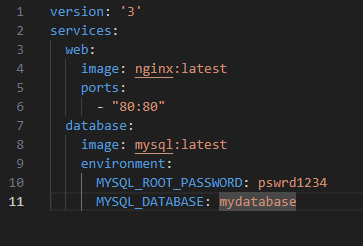
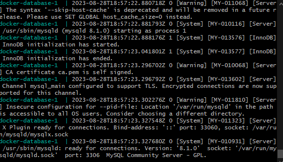
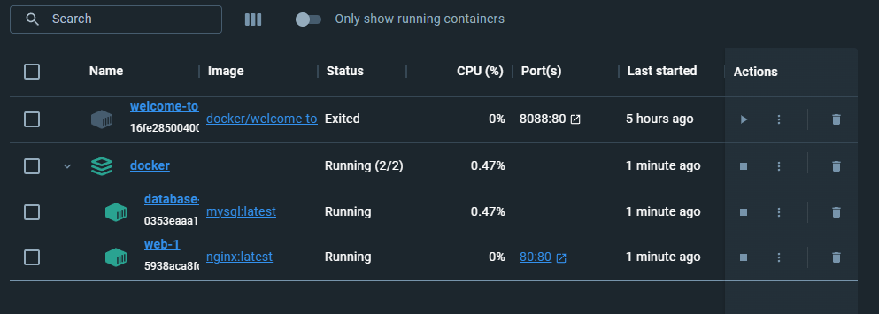
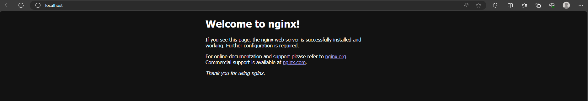

# Containers

Урок 5. Docker Compose и Docker Swarm

Первое задание: создать сервис из 2 различных контейнеров: 1 - веб, 2 - БД (compose)

Выполнение

Использую при выполнении задания Docker Desktop

Создаю под проект каталог, куда размещу файл YAML с названием 'compose.yml',
и ввожу внутрь

Захожу в каталог проекта через консоль и ввожу команду docker-compose up,
должно произойти такое

И теперь проверяю его видимость в докере

Можно проверить запустить контейнер в браузере через http://localhost или нажать на колонку Ports в Докере
